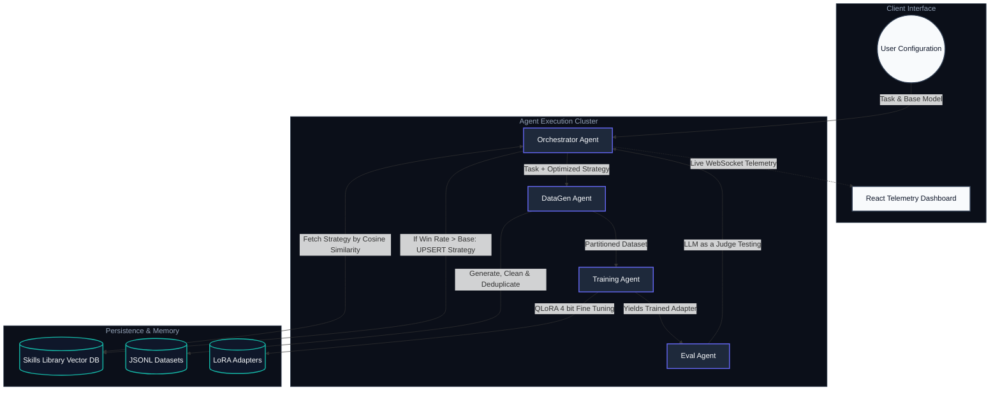

# VikaasLoop Engine Architecture

VikaasLoop is an autonomous, self-improving 5-agent system designed for the end-to-end fine-tuning of open-source Large Language Models. It automates synthetic data generation, model training, and objective evaluation, continuously learning from previous iterations through a persistent Skills Library.

## The 5 Agent Engine Loop

## Agent Technical Deep Dive

### 1. Orchestrator Agent (The Conductor)
**Role:** The central coordination router. It manages the asynchronous state machine of the entire pipeline, handling VRAM locks and error recovery.

*   **Inputs:** User configuration parameters (Base Model, Target Win Rate, Task Description).
*   **Outputs:** State transitions, validation logging, and real-time WebSocket telemetry emitted to the React frontend.
*   **Key Tech:** FastAPI, `asyncio` for non-blocking sub-agent invocation, PyJWT for WebSocket authentication.

### 2. Skills Library Agent (The Long-Term Memory)
**Role:** Persists successful instruction strategies. If an iteration increases the model win rate, the strategy is embedded and saved. Future loops query this library to find the best starting point for similar tasks.

*   **Inputs:** Win rate deltas from the Eval Agent, strategy metadata from the Orchestrator.
*   **Outputs:** Targeted strategy hints retrieved via mathematical similarity.
*   **Key Tech:** SQLite3 (WAL mode for concurrent reads), `numpy` for vectorized matrix multiplication, `sentence-transformers` for semantic text embedding.

### 3. DataGen Agent (The Teacher)
**Role:** Generates synthetic instruction and response pairs using a frontier LLM. It applies the strategy hint to ensure high-quality variance.

*   **Inputs:** Task Description, Strategy Hint.
*   **Outputs:** Cleaned, semantically deduplicated, and scored `.jsonl` files partitioned into training and evaluation sets.
*   **Key Tech:** Google GenAI SDK (Gemini Flash/Pro), aggressive JSON sanitization, structural deduplication logic.

### 4. Training Agent (The Student)
**Role:** Converts the generic base LLM into a specialized tool using Parameter Efficient Fine-Tuning. It strictly manages GPU memory to prevent crashes during autonomous execution.

*   **Inputs:** Partitioned JSONL datasets, HuggingFace base model identifiers.
*   **Outputs:** Saved LoRA adapter weights, tokenizer configs, and live training loss streams.
*   **Key Tech:** `transformers`, `trl` (SFTTrainer), `bitsandbytes` (NF4 quantization), Gradient Checkpointing, dynamic precision scaling (bfloat16).

### 5. Eval Agent (The Examiner)
**Role:** Objectively measures if the tuned model actually improved compared to its base self using cryptographic-grade visual diffing data.

*   **Inputs:** Held-out evaluation prompts, Base Model, Fine-Tuned Adapter.
*   **Outputs:** Absolute Win Rate percentage and Score Delta calculated by a strong Judge LLM.
*   **Key Tech:** LLM-as-a-Judge prompting, `peft` adapter hot-swapping, batched concurrent inference.